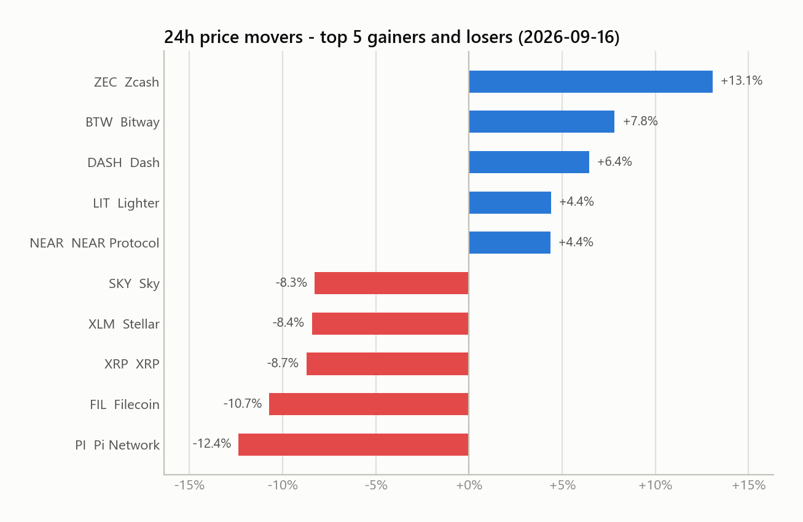

# Automated Data Workflow

A fully automated daily ETL + reporting pipeline. Every morning GitHub Actions pulls a market snapshot from a public API, validates it, stores it, compares it with yesterday, and emails an HTML report with charts. No server, no third-party scheduler, no manual step.

[](https://github.com/ylh551400/automated-data-workflow/actions/workflows/daily_pipeline.yml)
[](https://github.com/ylh551400/automated-data-workflow/actions/workflows/ci.yml)

---

## What it does

1. **Extract** the top-100 crypto assets from the [CoinGecko](https://www.coingecko.com/en/api) public API (retry with exponential backoff, honours rate-limit headers)
2. **Validate** the response schema so an upstream API change fails loudly instead of silently corrupting data
3. **Clean** with explicit data-quality rules; every dropped record is counted by rule
4. **Load** one snapshot per UTC day into SQLite (idempotent: a re-run on the same day is a no-op unless `--force`)
5. **Analyse** day-over-day: market cap change, top movers, rank climbers/fallers, coins entering or leaving the top 100
6. **Report** by email: HTML with inline charts and a plain-text fallback; the subject line alone tells you the status and the headline numbers
7. **Persist** the updated database back to the repository so history accumulates run after run

The data source changes every day, so the report always has something to say.

---

## Architecture

```
GitHub Actions (cron 01:00 UTC, or manual dispatch)
        │
        ▼
main.py ── orchestrator, exit codes 0 / 1 / 2
   │
   ├─ data_pipeline.py   fetch → validate schema → quality rules → SQLite (idempotent)
   ├─ insights.py        day-over-day comparison from stored snapshots
   ├─ charts.py          matplotlib PNGs: movers, market-cap share, trend
   └─ send_report.py     Jinja2 HTML email + inline images → SMTP
        │
        ├─ reports/latest_report.html   (workflow artifact, 14-day retention)
        └─ data/market_snapshots.db     (committed back to the repo)
```

All configuration lives in `config.py` and can be overridden with environment variables. Secrets are read from the environment only.

---

## Sample output

**Subject:** `✅ Daily Crypto Market Report 2026-09-16 | BTC $75.72K (-0.9%) | Top-100 cap $2.61T (+3.3% d/d)`

The email contains a status banner, KPI tiles (market cap, volume, BTC), an alert box when thresholds are crossed, gainers/losers tables, rank changes and composition changes since the previous snapshot, the charts below, and a pipeline-health section with the per-rule filter counts.

| 24h movers | Market cap concentration |
|---|---|
|  |  |

Status is encoded in the subject so the inbox works as a monitor:

| Status | Subject prefix | When |
|---|---|---|
| SUCCESS | ✅ | New snapshot stored |
| SKIPPED | ⚠️ | Today's snapshot already existed (double trigger) |
| FAILED | 🚨 | API, schema or storage failure. Error text is in the body. |

---

## Quick start (local)

```bash
git clone https://github.com/ylh551400/automated-data-workflow.git
cd automated-data-workflow
pip install -r requirements.txt

# Run everything, but only write reports/latest_report.html (no email)
python main.py --dry-run

# Replace today's snapshot if it already exists
python main.py --force
```

To actually send email locally, copy `.env.example` to `.env`, fill it in, and export the variables (or use a tool such as `direnv`). Without SMTP settings the pipeline still runs and writes the preview; it just logs that email was skipped.

```bash
pip install -r requirements-dev.txt
python -m pytest -q
```

---

## Scheduling with GitHub Actions

The workflow in `.github/workflows/daily_pipeline.yml` runs at 01:00 UTC daily and can be triggered manually from the Actions tab with `force` and `dry_run` toggles.

**One-time setup**, in the repository settings under *Secrets and variables → Actions*:

| Secret | Value |
|---|---|
| `SMTP_USER` | Gmail address that sends the report |
| `SMTP_PASSWORD` | A Gmail **App Password** (Google Account → Security → 2-Step Verification → App passwords). Regular passwords do not work. |
| `REPORT_TO` | Comma-separated recipients |
| `REPORT_FROM` | Optional, defaults to `SMTP_USER` |
| `SMTP_HOST` / `SMTP_PORT` | Optional, default `smtp.gmail.com` / `587` |
| `COINGECKO_API_KEY` | Optional demo key; anonymous access is enough for one call a day |

Each run:

1. installs dependencies and runs `python main.py`
2. commits `data/market_snapshots.db` back to the branch (`[skip ci]` so the CI workflow does not re-trigger)
3. uploads `reports/`, `charts/` and `pipeline.log` as a workflow artifact

The job has `concurrency` set so two runs can never write the database at the same time, and a 15-minute timeout.

### Why GitHub Actions instead of Make / Zapier

The scheduler lives in the repository next to the code, is versioned, free, has run logs and retry built in, and needs no extra account. Low-code tools add a hop and a hidden dependency for no benefit in a pipeline that is already fully scripted.

---

## Data quality rules

| Rule | Logic | Why |
|---|---|---|
| Price | `current_price > 0` and numeric | Zero or null price means a broken listing |
| Market cap | `market_cap > 0` and numeric | Needed for every share and total calculation |
| Rank | `market_cap_rank` present | Rank drives ordering and day-over-day comparison |
| 24h change | present and `> -100` | Missing or impossible values break the movers table |
| Freshness | `last_updated` within 24h | Stale rows would masquerade as today's data |
| Uniqueness | one row per `coin_id` per day | Prevents double counting |

Filtered counts per rule are logged and shown in the email. If fewer than 90 clean records remain (configurable), the report carries a warning.

---

## Error handling and exit codes

| Scenario | Behaviour |
|---|---|
| Timeout, connection error, HTTP 5xx | Retry up to 4 times, backoff 5s → 10s → 20s |
| HTTP 429 | Retry, waiting at least `Retry-After` seconds |
| HTTP 4xx (other), invalid JSON | Fail immediately (retrying cannot help) |
| Schema change | Pipeline fails; FAILED email with the missing field names |
| Fewer clean records than expected | Pipeline continues; warning in email |
| Same-day re-run | Storage skipped; SKIPPED email |
| SMTP not configured | Report written to `reports/`, email skipped, exit 0 |
| SMTP configured but delivery fails | Exit 2 so the workflow run turns red |

| Exit code | Meaning |
|---|---|
| 0 | Success or skipped |
| 1 | Pipeline failed (a FAILED report was still generated) |
| 2 | Report delivery failed |

---

## Project structure

```
automated-data-workflow/
├── .github/workflows/
│   ├── daily_pipeline.yml   # scheduled ETL + email + DB commit
│   └── ci.yml               # pytest on push / PR (Python 3.10 and 3.12)
├── config.py                # all settings, env-overridable
├── main.py                  # orchestrator
├── data_pipeline.py         # extract / validate / clean / load
├── insights.py              # day-over-day analysis
├── charts.py                # matplotlib charts
├── send_report.py           # HTML email + SMTP
├── templates/report.html.j2 # email template
├── tests/                   # 48 unit tests, no network needed
├── data/market_snapshots.db # history (written by the workflow)
├── docs/                    # sample chart images for this README
├── .env.example
├── requirements.txt
└── requirements-dev.txt
```

---

## Possible next steps

- Slack or Teams webhook alongside email for FAILED runs
- Move storage from SQLite-in-git to a hosted Postgres (Supabase, Neon) once history grows
- Weekly digest with 7-day charts built from the same snapshots
- Anomaly detection on volume spikes per coin
